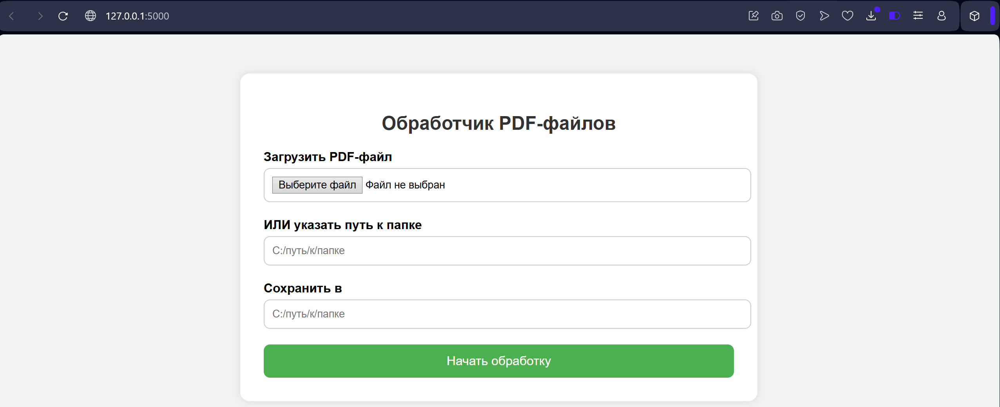

# My_pdf_scaner

Flask-приложение для быстрого распознавания PDF-документов. Поддерживает как одиночную загрузку PDF-файлов, так и пакетную обработку директорий с PDF-файлами. Результаты сохраняются в формате JSON.



## ⚙️ Стек технологий

| Категория      | Компонент                   |
|----------------|-----------------------------|
| Язык           | Python 3.11.9               |
| Веб-сервер     | Flask 3.1.1                       |
| PDF-парсинг    | [`PyMuPDF`](https://pymupdf.readthedocs.io/) (`fitz`)|
| Frontend       | HTML5 + Bootstrap-like разметка |
| Развёртывание  | `flask run` / WSGI |

## 📁 Архитектура

- `extract.py`: Функции для парсинга PDF, возвращает Python-словарь;
- `runner.py`: многопоточная обработка директории;
- `server.py`: обработка пользовательских запросов.

#### runner.py
Параллельная обработка реализована через `ThreadPoolExecutor`:

- эффективное решение CPU-bound задач (декодирование и парсинг PDF);
- обработка **десятков PDF одновременно**;
- не блокировать основной поток Flask.


```python
with ThreadPoolExecutor(max_workers=os.cpu_count()) as executor:
    futures = [executor.submit(process_single_pdf, path, output_dir) for path in pdf_files]
```


## Логика работы приложения при обработке директории с файлами
1. Пользователь вводит **путь к директории**
2. Flask (server.py) отправляет POST-запрос
3. Выполняется проверка **пути к директории**, если он правильный, вызывается метод process_pdf_folder()
4. Метод app/runner.py : process_pdf_folder(folder, output_dir) :
   1. Получает списток PDF-файлов `pdf_files = [file1.pdf, file2.pdf, ...]`
   2. Создает пул потоков (ThreadPoolExecutor)
```
┌─────────────┐ ┌─────────────┐ ┌─────────────┐
│  Поток №1   │ │  Поток №2   │ │  Поток №3   │ ...
└─────────────┘ └─────────────┘ └─────────────┘
     ↑               ↑               ↑
     |               |               |
 готов к приёму   готов к приёму  готов к приёму
     задач           задач           задач
```
Количество потоков обычно соответствует количеству логических ядер CPU max_workers=os.cpu_count()

   3. Задачи по обработке файлов (вызов функции process_pdf_file) отправляются в пул (executor.submit(...)). executor.submit(...) возвращает объект Future, который представляет собой обещание результата в будущем. Все  Future собираются в список futures.
```
┌ file1.pdf ┐ → Поток 1 → process_pdf_file(file1)
┌ file2.pdf ┐ → Поток 2 → process_pdf_file(file2)
┌ file3.pdf ┐ → Поток 3 → process_pdf_file(file3)
(и так далее)
```
Для каждого файла выполняется:
process_pdf_file():
   - открыть PDF через fitz (PyMuPDF);
   - извлечь текст/данные;
   - сохранить JSON в output_dir.

   4. Ожидание завершения задач (as_completed). as_completed(futures) — итератор, возвращающий Future объекты по мере завершения задач, не дожидаясь строгого порядка.

```
[Future<file3>] завершён → получить результат
[Future<file1>] завершён → получить результат
[Future<file2>] завершён → получить результат
...

```
5. "Обработка завершена"

JSON-файлы с результатами находятся в `output_dir`.

---

## Как запустить

1. Клонируйте репозиторий:

```bash
git clone https://github.com/your-user/my_pdf_scaner.git
cd my_pdf_scaner
```

2. Установите зависимости:

```bash
pip install -r requirements.txt
```

3. Запустите сервер:

```bash
flask run
```

4. Перейдите в браузере на [`http://127.0.0.1:5000`](http://127.0.0.1:5000)
